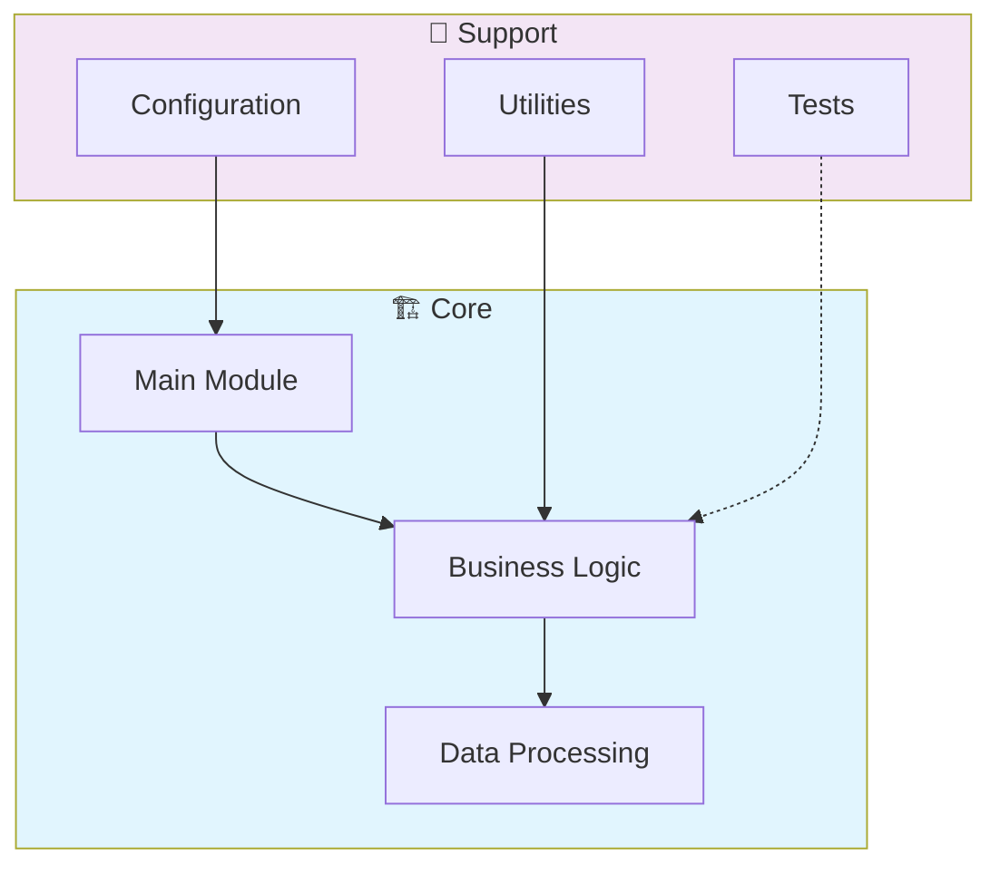

# 📊 Javascript D3 Data Visualization

> Data Science project - javascript-d3-data-visualization

[](https://img.shields.io/badge/)
[](LICENSE)

[English](#english) | [Português](#português)

---

## English

### 🎯 Overview

**Javascript D3 Data Visualization** is a production-grade JavaScript application complemented by CSS, HTML that showcases modern software engineering practices including clean architecture, comprehensive testing, containerized deployment, and CI/CD readiness.

The codebase comprises **4,816 lines** of source code organized across **33 modules**, following industry best practices for maintainability, scalability, and code quality.

### ✨ Key Features

- **🔄 Data Pipeline**: Scalable ETL with parallel processing
- **✅ Data Validation**: Schema validation and quality checks
- **📊 Monitoring**: Pipeline health metrics and alerting
- **🔧 Configurability**: YAML/JSON-based pipeline configuration

### 🏗️ Architecture



### 🚀 Quick Start

#### Prerequisites

- Node.js 20+
- npm or yarn

#### Installation

```bash
# Clone the repository
git clone https://github.com/galafis/javascript-d3-data-visualization.git
cd javascript-d3-data-visualization

# Install dependencies
npm install
```

#### Running

```bash
# Development mode
npm run dev

# Production build
npm run build
npm start
```

### 🧪 Testing

```bash
# Run all tests
npm test

# Run with coverage
npm run test:coverage

# Run in watch mode
npm run test:watch
```

### 📁 Project Structure

```
javascript-d3-data-visualization/
├── public/
├── src/          # Source code
│   ├── charts/
│   │   ├── BarChart.js
│   │   ├── BaseChart.js
│   │   ├── ChartFactory.js
│   │   ├── GeographicMap.js
│   │   ├── Heatmap.js
│   │   ├── LineChart.js
│   │   ├── PieChart.js
│   │   ├── RealTimeChart.js
│   │   ├── ScatterPlot.js
│   │   └── WebGL3DChart.js
│   ├── core/          # Core configuration
│   │   ├── AnimationEngine.js
│   │   ├── DataProcessor.js
│   │   ├── DataVisualizer.js
│   │   └── EventManager.js
│   ├── data/
│   │   ├── geographic-data.json
│   │   ├── sales-data.json
│   │   └── time-series.json
│   ├── styles/
│   ├── utils/         # Utilities
│   │   ├── dataLoader.js
│   │   ├── formatters.js
│   │   ├── helpers.js
│   │   └── statistics.js
│   └── main.js
├── tests/         # Test suite
│   ├── unit/
│   │   ├── BarChart.test.js
│   │   ├── GeographicMap.test.js
│   │   ├── Heatmap.test.js
│   │   ├── LineChart.test.js
│   │   ├── PieChart.test.js
│   │   ├── RealTimeChart.test.js
│   │   ├── ScatterPlot.test.js
│   │   └── WebGL3DChart.test.js
│   └── README.md
├── LICENSE
├── README.md
├── package.json
└── webpack.config.js
```

### 🛠️ Tech Stack

| Technology | Description | Role |
|------------|-------------|------|
| **JavaScript** | Core Language | Primary |
| CSS | 3 files | Supporting |
| HTML | 2 files | Supporting |

### 🤝 Contributing

Contributions are welcome! Please feel free to submit a Pull Request. For major changes, please open an issue first to discuss what you would like to change.

1. Fork the project
2. Create your feature branch (`git checkout -b feature/AmazingFeature`)
3. Commit your changes (`git commit -m 'Add some AmazingFeature'`)
4. Push to the branch (`git push origin feature/AmazingFeature`)
5. Open a Pull Request

### 📄 License

This project is licensed under the MIT License - see the [LICENSE](LICENSE) file for details.

### 👤 Author

**Gabriel Demetrios Lafis**
- GitHub: [@galafis](https://github.com/galafis)
- LinkedIn: [Gabriel Demetrios Lafis](https://linkedin.com/in/gabriel-demetrios-lafis)

---

## Português

### 🎯 Visão Geral

**Javascript D3 Data Visualization** é uma aplicação JavaScript de nível profissional, complementada por CSS, HTML que demonstra práticas modernas de engenharia de software, incluindo arquitetura limpa, testes abrangentes, implantação containerizada e prontidão para CI/CD.

A base de código compreende **4,816 linhas** de código-fonte organizadas em **33 módulos**, seguindo as melhores práticas do setor para manutenibilidade, escalabilidade e qualidade de código.

### ✨ Funcionalidades Principais

- **🔄 Data Pipeline**: Scalable ETL with parallel processing
- **✅ Data Validation**: Schema validation and quality checks
- **📊 Monitoring**: Pipeline health metrics and alerting
- **🔧 Configurability**: YAML/JSON-based pipeline configuration

### 🏗️ Arquitetura


### 🚀 Início Rápido

#### Prerequisites

- Node.js 20+
- npm or yarn

#### Installation

```bash
# Clone the repository
git clone https://github.com/galafis/javascript-d3-data-visualization.git
cd javascript-d3-data-visualization

# Install dependencies
npm install
```

#### Running

```bash
# Development mode
npm run dev

# Production build
npm run build
npm start
```

### 🧪 Testing

```bash
# Run all tests
npm test

# Run with coverage
npm run test:coverage

# Run in watch mode
npm run test:watch
```

### 📁 Estrutura do Projeto

```
javascript-d3-data-visualization/
├── public/
├── src/          # Source code
│   ├── charts/
│   │   ├── BarChart.js
│   │   ├── BaseChart.js
│   │   ├── ChartFactory.js
│   │   ├── GeographicMap.js
│   │   ├── Heatmap.js
│   │   ├── LineChart.js
│   │   ├── PieChart.js
│   │   ├── RealTimeChart.js
│   │   ├── ScatterPlot.js
│   │   └── WebGL3DChart.js
│   ├── core/          # Core configuration
│   │   ├── AnimationEngine.js
│   │   ├── DataProcessor.js
│   │   ├── DataVisualizer.js
│   │   └── EventManager.js
│   ├── data/
│   │   ├── geographic-data.json
│   │   ├── sales-data.json
│   │   └── time-series.json
│   ├── styles/
│   ├── utils/         # Utilities
│   │   ├── dataLoader.js
│   │   ├── formatters.js
│   │   ├── helpers.js
│   │   └── statistics.js
│   └── main.js
├── tests/         # Test suite
│   ├── unit/
│   │   ├── BarChart.test.js
│   │   ├── GeographicMap.test.js
│   │   ├── Heatmap.test.js
│   │   ├── LineChart.test.js
│   │   ├── PieChart.test.js
│   │   ├── RealTimeChart.test.js
│   │   ├── ScatterPlot.test.js
│   │   └── WebGL3DChart.test.js
│   └── README.md
├── LICENSE
├── README.md
├── package.json
└── webpack.config.js
```

### 🛠️ Stack Tecnológica

| Tecnologia | Descrição | Papel |
|------------|-----------|-------|
| **JavaScript** | Core Language | Primary |
| CSS | 3 files | Supporting |
| HTML | 2 files | Supporting |

### 🤝 Contribuindo

Contribuições são bem-vindas! Sinta-se à vontade para enviar um Pull Request.

### 📄 Licença

Este projeto está licenciado sob a Licença MIT - veja o arquivo [LICENSE](LICENSE) para detalhes.

### 👤 Autor

**Gabriel Demetrios Lafis**
- GitHub: [@galafis](https://github.com/galafis)
- LinkedIn: [Gabriel Demetrios Lafis](https://linkedin.com/in/gabriel-demetrios-lafis)
